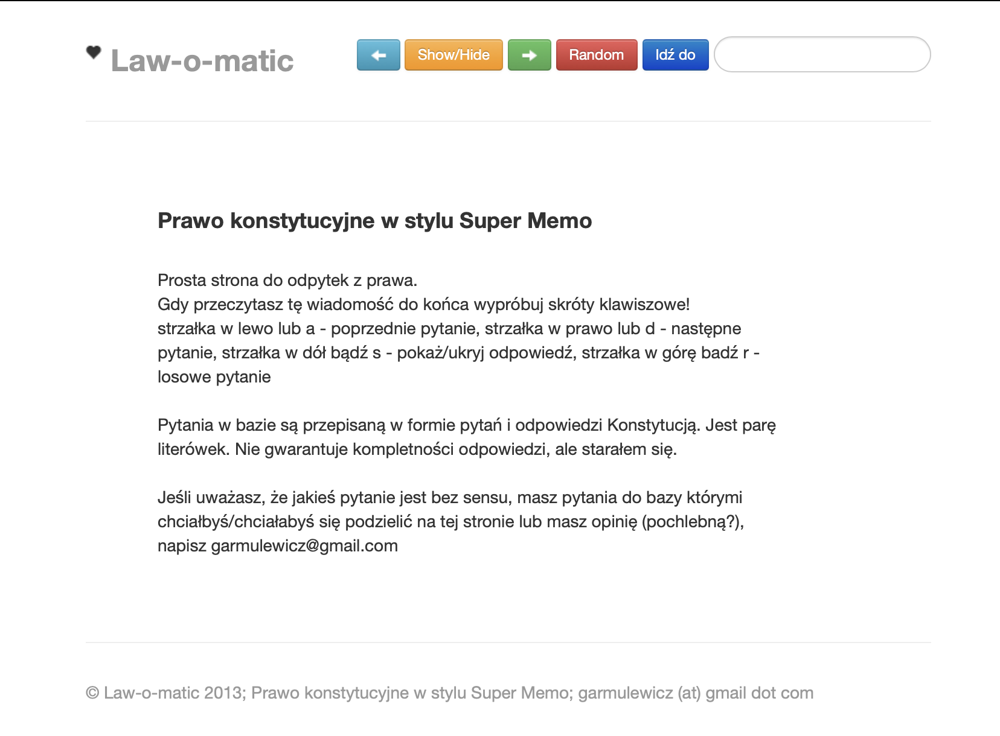

lawSchool
=========

This is a website for spaced-repetition (Super Memo style) learning of Polish constitutional law.
I made it in 2013 while I was studying law, math & computer science at the same time. 
You can imagine time management was tricky :). I got a 4/5 grade in the end, not bad, that was a hard course.

It looked like this

You can run it `node server.js` and then visit `localhost:1337`. 
Probably doesn't really work anymore, web technologies change pretty fast.
